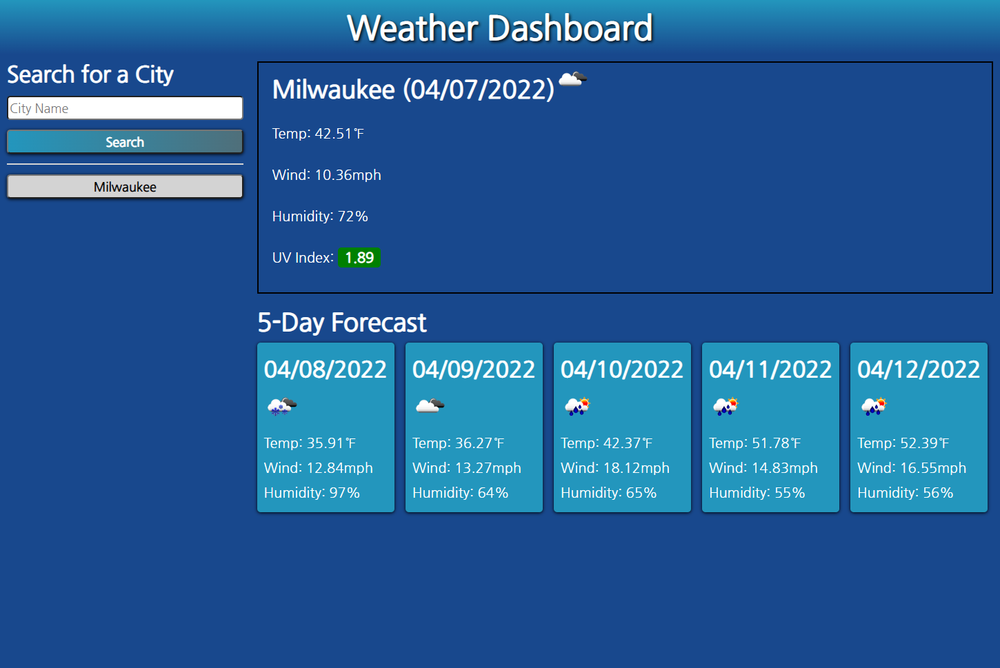

# Module 6 Challenge - Weather Dashboard

## This app has the following functionality
- User types in a city name and clicks search, after which API calls and displays current weather and 5 day forcast
- Weather data includes current temp, wind speed, humidity and UV index, which is color coded based on severity
- A search button is generated for each previously searched city, and is saved to local storage to persist for the next time time user loads the app
- 

---
[Deployment Link](https://agoetz4407.github.io/weather-dashboard/)

---
